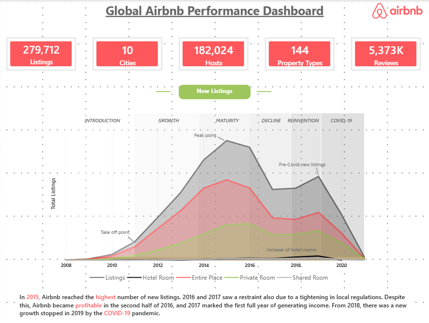
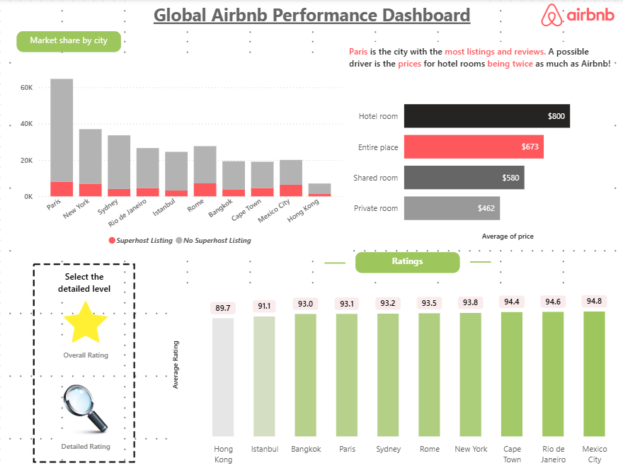
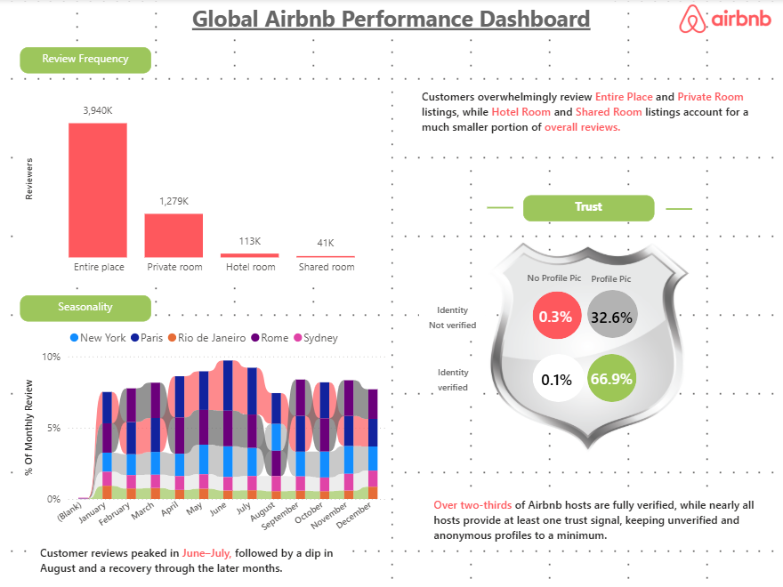

# <H1>GLOBAL AIRBNB PERFORMANCE DASHBOARD</H1>

## <H2>1. Project Title</H2>

🏠 **Global Airbnb Performance Dashboard**

## <H2>2. Short Description</H2>

A Power BI dashboard for analyzing **global Airbnb performance**. It provides insights into listings, cities, property types, pricing, ratings, reviews, seasonality, and host verification to understand market performance and customer behavior.

## <H2>3. Tech Stack</H2>

• 📊 Power BI Desktop

• 📂 Power Query

• 🧠 DAX

• 🔗 Data Modeling

• 📁 .pbix / .pbit / .png

## <H2>4. Data Source</H2>

**Source:** Kaggle.com

The dataset includes Airbnb-related information such as:

• Listing details

• City and location

• Property type / Room type

• Host information

• Reviews and ratings

• Pricing

• Superhost status

• Host verification

• Listing dates and availability

## <H2>5. Features / Highlights</H2>

### 🔎 Business Problem

Global Airbnb data contains a large number of listings, hosts, reviews, cities, and property types, making it difficult to quickly identify market trends, pricing patterns, customer preferences, and host performance.

## <H2>🎯 Goal of the Dashboard</H2>

• Track the growth of Airbnb listings

• Compare market share across cities

• Analyze pricing by room type

• Understand customer ratings and reviews

• Identify seasonal review patterns

• Analyze host verification and trust

• Compare property and room-type performance

• Support data-driven business decisions

## <H2>📊 Key Visuals</H2>

### 📌 KPI Overview

• **279,712** Listings

• **10** Cities

• **182,024** Hosts

• **144** Property Types

• **5,373K** Reviews

### 📈 Listing Growth Analysis

• New listings over time

• Listing growth by room type

• Major growth, maturity, decline, and COVID-19 periods

• Peak listing period identification

### 🌍 Market Share by City

• Listings by city

• Superhost vs Non-Superhost listings

• Comparison of major Airbnb markets

• City-level market share analysis

### 💰 Price Analysis

• Average price by room type

• Hotel Room

• Entire Place

• Shared Room

• Private Room

### ⭐ Ratings Analysis

• Average rating by city

• City-level rating comparison

• Overall and detailed rating analysis

• Identification of highest- and lowest-rated markets

### 📝 Review Frequency

• Reviews by room type

• Entire Place review volume

• Private Room review volume

• Hotel Room review volume

• Shared Room review volume

### 📅 Seasonality Analysis

• Monthly review trends

• Review patterns across major cities

• Seasonal peaks and declines

• Comparison of New York, Paris, Rio de Janeiro, Rome, and Sydney

### 🛡️ Host Trust Analysis

• Verified vs unverified hosts

• Profile picture availability

• Identity verification

• Trust signals across Airbnb hosts

### 🎛️ Filters

• City

• Room Type

• Property Type

• Host Status

• Rating level

• Time period

## <H2>🚀 Business Impact</H2>

• Identifies high-performing Airbnb markets

• Helps understand pricing differences between room types

• Highlights cities with strong customer ratings

• Reveals seasonal customer-review patterns

• Supports host-performance analysis

• Provides insights into customer trust and verification

• Helps identify market growth and decline periods

• Supports data-driven Airbnb business decisions

## <H2>6. Screenshots</H2>

### 📊 Overview Dashboard

The dashboard provides a high-level view of Airbnb listings, city market share, pricing, ratings, and listing growth.

 

### ⭐ Ratings Dashboard

The ratings page compares average Airbnb ratings across major cities and provides an overall/detailed rating view.

 

### 📝 Reviews Dashboard

The reviews page analyzes review frequency, seasonality, and host trust/verification patterns.

 

